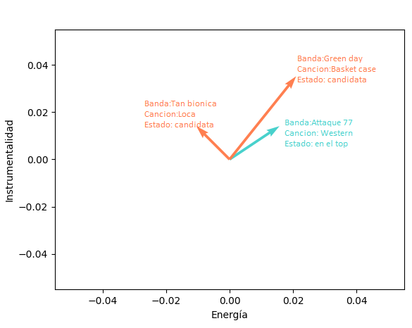

# Sistema de Recomendación de Música en Spotify con Filtrado Basado en Contenido

Este documento describe la implementación del sistema de recomendación de música en Spotify utilizando el enfoque de filtrado basado en contenido.

## Descripción General

El sistema utiliza la API de Spotify para obtener características de audio de las canciones y genera recomendaciones personalizadas basadas en las preferencias del usuario.

## Idea del algotimo

### 1. Extracción de canciones mas escuchadas

Lo primero que hice fue utilizar API de Spotify para obtener un top de las canciones mas escuchadas.

Pueden tomarse a corto, largo y plazo `short_term`, `medium_term`, `long_term` respectivamente.

### 2. Extracción de Características de Audio

Cada canción tiene en total unas 12 caracteristicas como por ejemplo:

- Acousticness
- Danceability
- Duración
- Energía
- Instrumentalidad
- Tonalidad
- Valence, entre otras.

Entonces podemos ver cada canción como un vector en un espacio de 12 dimensiones, lo cual será muy importante más adelante para comparar canciones entre sí.

### 3. Obtención de canciones candidatas

A partir de las canciones favoritas del usuario, se obtienen nuevas canciones a las cuales llamaremos canciones candidatas.

Para ello, se buscan artistas y bandas relacionados con las bandas en el top, para cada uno de estos nuevos artistas se trae una cierta cantidad de canciones similares, basándonos en el análisis del historial de reproducciones de la comunidad de Spotify.

En esta nueva lista de canciones, estarán las canciones a agregar a la playlist, en concreto agregaremos las canciones cuando estas sean suficientemente "parecidas" a canciones en el top.

### 4. Cálculo de Similaridad entre Canciones

Ahora abordamos la cuestión de cómo determinar si dos canciones son similares, 
como vimos con anterioridad de cierta forma podemos representar las canciones como vectores, lo que 
nos permite pasar de un problema complejo a un problema mas simple.

Para medir la similitud entre dos vectores (canciones), utilizamos la "distancia coseno". Esta medida evalúa el coseno del ángulo entre los dos vectores, indicando que si la similitud es cercana a 1, las canciones son "parecidas" en términos de sus atributos. En cambio, si las canciones son muy diferentes, la similitud será cercana a 0.

Finalmente, comparamos todas las canciones candidatas con las canciones que sabemos que le gustaron al usuario. Si la similitud supera un cierto umbral, agregamos la canción a la playlist. Este proceso nos permite ofrecer recomendaciones personalizadas basadas en las preferencias del usuario.

 
 
Veamos un ejemplo muy simplificado, tomando solo dos dimensiones: Energía e Instrumentalidad.

Tenemos la canción "western", la cual el usuario escucha con frecuencia, y las canciones "loca" y "basket case" como canciones candidatas.

Sin embargo, podemos observar que la canción "basket case" es más cercana a la canción en el top, por lo que el algoritmo optará por recomendar esa en lugar de "loca".

